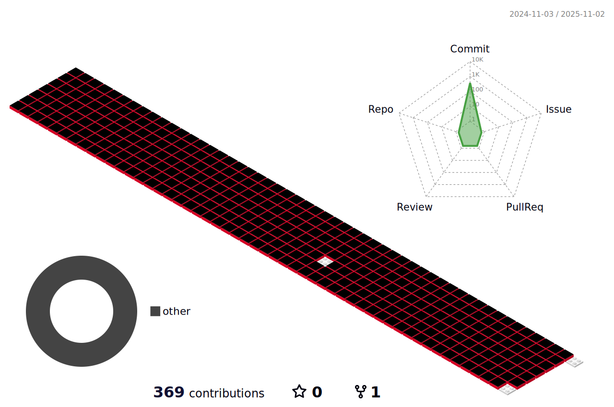

  

<h1 align="left">Hi 👋, I'm Aria!</h1>
<h3 align="left">A Creative realistic content developer from South Korea</h3>

  

- 🔭 제가 진행 중인 프로젝트는 [OOO이고, 링크는 다음과 같습니다.](link)

- 🌱 저는 현재 AR, VR 분야에 관심이 많아서 **Google AR Core에 대해 공부하고 있습니다.**

- 👯 저는 열정넘치고, 계획을 잘 짜는 사람과 **실감형 콘텐츠 프로젝트를 함께 만들어나가고 싶습니다.**

- 🤝 저는 실감형 콘텐츠 프로젝트를 위해 **OO 도움이 있으면 좋겠습니다.**

- 👨‍💻 저의 모든 포트폴리오는 오른쪽 링크를 확인해주세요 [https://www.notion.so/42c4af42074848958b416b6d4c9c5ca3](https://www.notion.so/42c4af42074848958b416b6d4c9c5ca3)

- 💬 오른쪽 내용을 물어보세요! **C#, Unity Development**

- 📫 오른쪽 이메일로 연락주세요 **alsgp25@gmail.com**

<h3 align="left">Connect with me:</h3>

<h3 align="left">Languages and Tools:</h3>

                

&nbsp;

